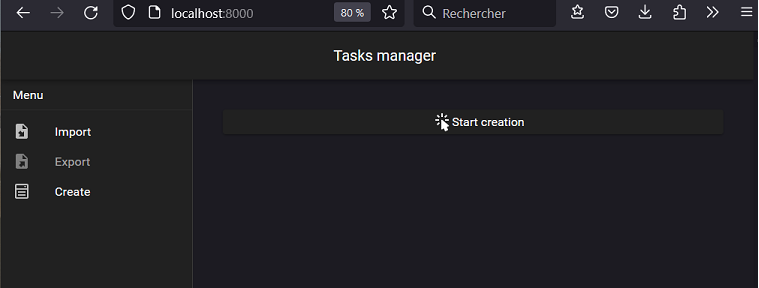
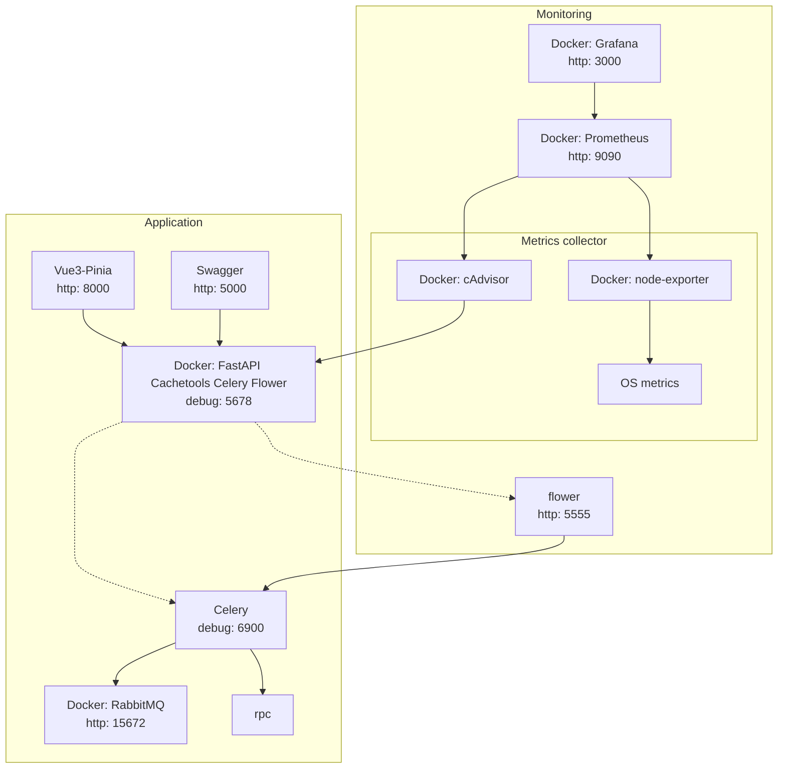

# Task List

Click on thumbnail to see it in action

[](./doc/App_running.gif)]

## Overview

Frontend : 
  - App : [Vue3](https://vuejs.org/), [Nuxt3](https://nuxt.com/), [Pinia](https://pinia.vuejs.org/)
  - Component Framework : [Vuetify3](https://vuetifyjs.com/)
  - Testing : [Vitest](https://vitejs.dev) and [Playwright](https://playwright.dev/)

Backend : 
  - Server : [python3](https://www.python.org/), [FastAPI](https://fastapi.tiangolo.com/), [pytest](https://docs.pytest.org)
  - Cache : [cachetools](https://pypi.org/project/cachetools/)
  - Distributed Task Queue : [Celery](https://docs.celeryq.dev)
  - Broker : [RabbitMQ](https://www.rabbitmq.com/)

Monitoring : 
  - Dashboards : [Grafana](https://grafana.com/)
  - Metrics collector DB : [Prometheus](https://prometheus.io/) 
  - OS / containers exporters : [cAdvisor](https://github.com/google/cadvisor) and [node-exporter](https://github.com/prometheus/node_exporter)
  - Celery monitoring : [flower](https://flower.readthedocs.io)

## Architecture Diagram



## Functionalities

Recursive task manager, with import / export JSON file and server-side lazy loading management.

 - Running advices :
   - After [starting server services](./README#start-up), [logs the backend](./README#logs) to know when the application will be ready.
 - Known limitations :
   - Tasks Queue are not persistent, as I used `rpc` and `cachetools`. Cache is configured to handle 100 items for 1 hour.

If you want to play with monitoring :
  1. Go to Grafana administration, and visualize `Docker Containers ` and `Docker Host` to monitor respectively Docker containers performances and host performances.
  2. You can can generate your own random task tree via the `/generate` endpoint. The file will be generated in `./data`
  3. Importing the generated JSON file, or any other heavy JSON file.


## Setup

Make sure to install the dependencies:

[Docker](https://www.docker.com/), [npm](https://www.npmjs.com/)

## Configuration

 - Maybe check your .wslconfig, especially for small Hardware configuration :

```
[wsl2]
memory=1GB
processors=4
```

 - I put some ridiculously low values to play with jobs workflows, you can edit them here [nuxt.config.ts](./services/frontend/nuxt.config.ts), values will be watched and reloaded

```ts
vite: {
    define: {
      VUE_APP_JOB_RETRY_MAX: 3, // default : 10
      VUE_APP_JOB_RETRY_TIMEOUT: 50  // ms default : 1000
    },
```

## Start up

- frontend (`http://localhost:8000`)

```bash
> /services/frontend
npm run dev
```

- backend (`http://localhost:5000`)

```bash
docker compose up
```
or
```bash
docker compose --profile monitor up -d #starts also monitoring
```

- Monitoring via Grafana (`http://localhost:3000`)

    login : admin/admin

  - Prometheus (`http://localhost:9090`)

```bash
docker compose up grafana  #starts only monitoring
```

- Monitoring Celery tasks via Flower (`http://localhost:5555`)

- API docs (`http://localhost:5000/docs`)

## debug

- backend
  
  Launch and attach `debugpy` on `0.0.0.0:5678`
  Include `--wait-for-client` to debugpy if you need to debug server from the launch

  - Debug Celery Task logic
  
    put breakpoint in task content `rdb.set_trace()` then
```bash
telnet 127.0.0.1 6899
```

I provided VScode configuration to debug with breakpoints.

## logs

```bash
docker-compose logs -f <service-name>
```

## tests

- backend

```bash
docker exec -it <containerID> /bin/bash
pytest
```

- frontend unit test

```bash
> /services/frontend
npm run test
```

- frontend e2e test

```bash
> /services/frontend
npm run dev
npm run test:e2e
```

## Configuration


### Grafana dashboard

Following the recommandation given by [stefanprodan](https://github.com/stefanprodan) in its [Grafana template](https://github.com/stefanprodan/dockprom), big thanks to him :

For storage and particularly Storage Load graph, you have to specify the fstype in grafana graph request.
You can find it in `grafana/provisioning/dashboards/docker_containers.json`, at line 406 :

```yaml
"expr": "(node_filesystem_size_bytes{fstype=\"ext4\"} - node_filesystem_free_bytes{fstype=\"ext4\"}) / node_filesystem_size_bytes{fstype=\"ext4\"}  * 100"，
```

I work on ext4, so i need to change `btrfs` to `ext4`.

You can find right value for your system in Prometheus `http://<host-ip>:9090` launching this request :

```yaml
node_filesystem_size_bytes
node_filesystem_free_bytes
```
